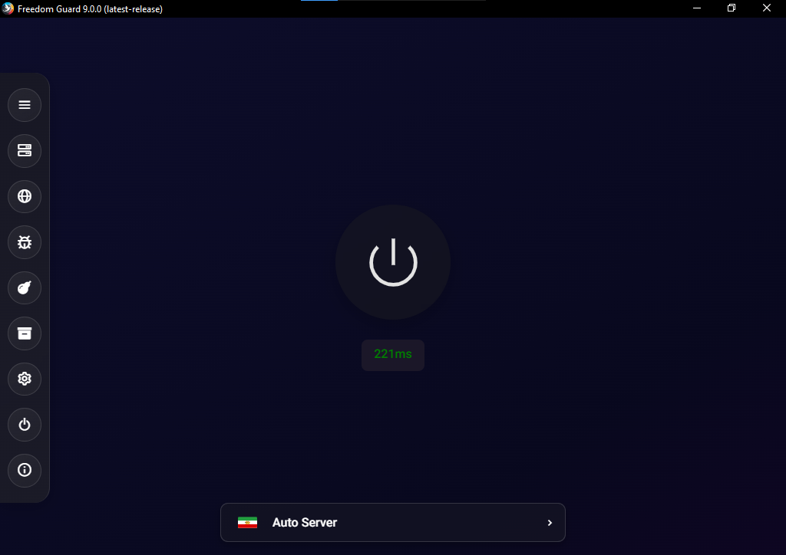
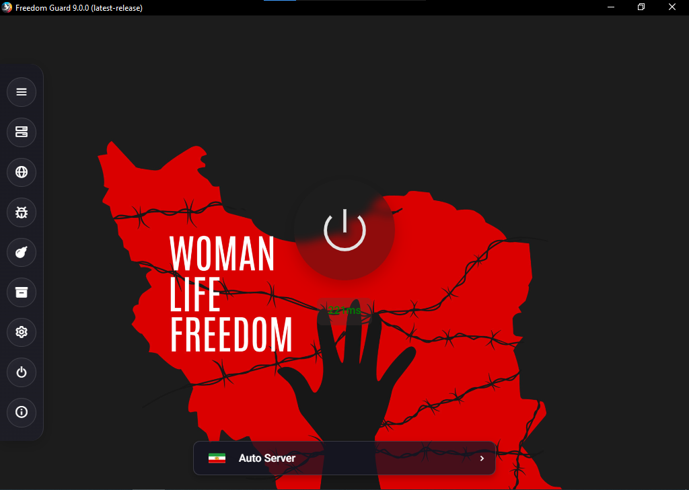
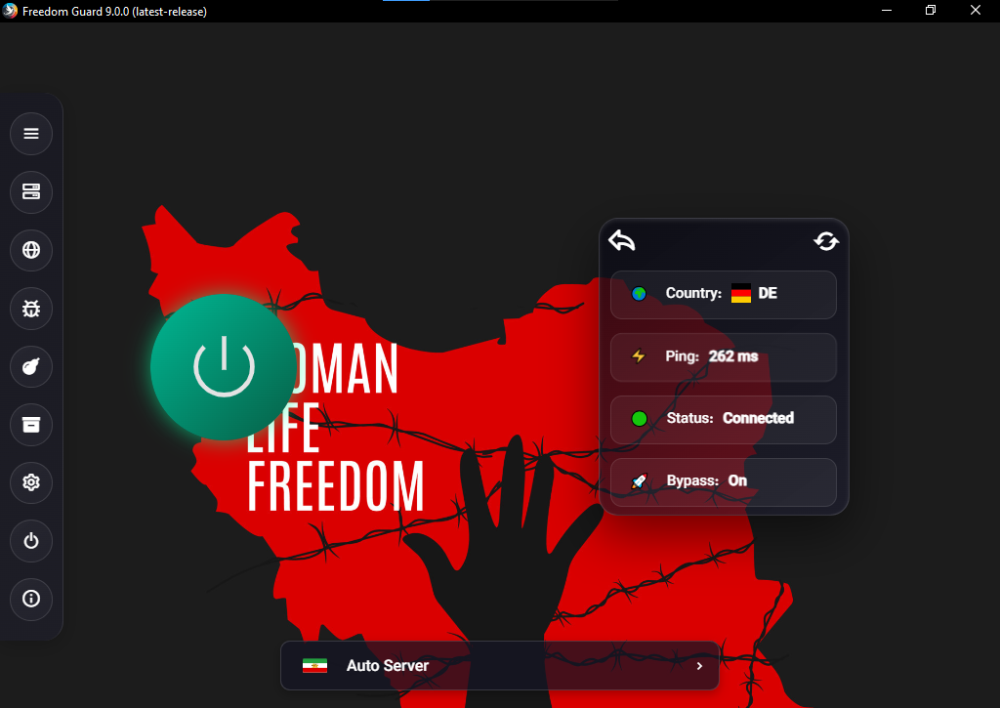

# Freedom Guard

    <a href="README-fa.md">
    <small>فارسی</small>
    
    </a>
        | 
    
    <small>English</small>

  
🖥️ Looking for Mobile?  
  👉 <a href="https://github.com/Freedom-Guard/FG_MOBILE">Freedom Guard Mobile</a>

**Freedom Guard** is a tool designed for bypassing internet censorship, providing the best methods for connecting to a free internet. It enhances your security, speed, and privacy while ensuring an unrestricted browsing experience.

**Woman, Life, Freedom**

## 
Download the latest version   دانلود آخرین نسخه

<table>
    <thead align=center>
        <tr>
            <th>OS</th>
            <th>Download</th>
        </tr>
    </thead>
    <tbody align=left>
        <tr>
            <td>Windows</td>
            <td>
                 
            </td>
        </tr>
        <tr>
            <td>Linux</td>
            <td>
                 
                 
                 
            </td>
        </tr>
        </tr>
        <tr>
            <td>Android</td>
            <td>
                 
            </td>
        </tr>
        <tr>
            <td>macOS</td>
            <td>
                 
                 
            </td>
        </tr>
    </tbody>

</table>

## Software Overview

**Freedom Guard** is an open-source tool designed to help you easily bypass internet censorship. It includes the best protocols and methods for connecting to the free internet.

## 🚀 Key Features of Freedom Guard

* **💶 Completely Free**: Free access for all users.
* **😶‍🌫️ Open-Source**: Guarantees transparency and security.
* **✔️ Supports Multiple Configurations**: Including Trojan, SSH, Vmess, Vless, WireGuard, Warp-Plus, and more.
* **🚀 Automatic Configurations**: Easy access to free internet with auto-setup.
* **👩‍💻 ISP Config Testing**: Test various configurations to find the best performance.
* **👌 Freedom Browser**: Fast, secure, and private.
* **🤖 Regular Updates**: Auto-updating configurations to ensure stability.

## 🚀 Sections of Freedom Guard

* **📡 DNS Changer**: A tool to quickly and easily change DNS to improve security and boost connection speed.
* **🌐 Freedom Vibe**: An advanced tool for traffic obfuscation using **Hiddify Core**, ideal for bypassing censorship.
* **🚀 Freedom Warp**: A tool for connecting to the free internet using **Warp Plus** and other protocols with advanced configuration options.
* **🔒 Freedom Browser**: A secure, fast, and private browser with an integrated VPN to access the internet without restrictions.

## 📸 Screenshots

### Freedom Guard Interface

## ⚡ Installation Guide

### **Windows**

1. Download the latest Windows installer or portable version from the [Releases page](https://github.com/Freedom-Guard/Freedom-Guard/releases).
2. Run the installer or extract the portable version.
3. Launch the application.

### **macOS**

1. Download the latest macOS DMG or ZIP from the [Releases page](https://github.com/Freedom-Guard/Freedom-Guard/releases).
2. Open the DMG and drag the application to your **Applications** folder, or extract the ZIP file.
3. Launch the application.

### **Linux**

1. Download the latest Linux package (DEB, RPM, AppImage, or tar.gz) from the [Releases page](https://github.com/Freedom-Guard/Freedom-Guard/releases).
2. Install the package using your package manager or extract the archive.
3. Launch the application.

## ⚡ Automatic Configuration

Freedom Guard’s automatic configuration system gathers configurations from public sources, including Telegram channels and user contributions. Configurations are updated daily for different ISPs, providing the best ways and configurations for connecting to the internet.

## 📬 Contact

* **Twitter**: [@Freedom\_Guard\_N](https://x.com/Freedom_Guard_N)

## 👇 Acknowledgements

* **Hiddify-Core** from Hiddify
* **Warp-Plus** from bepass-org

